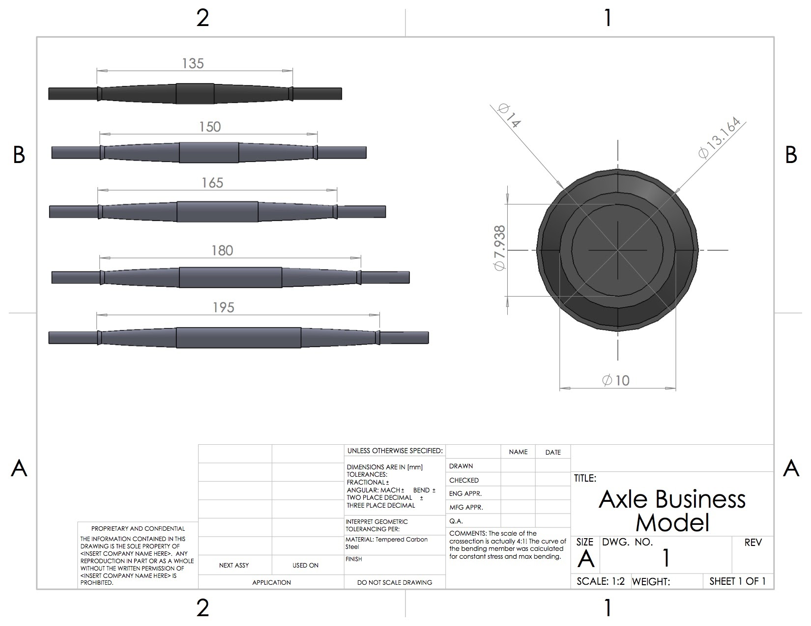
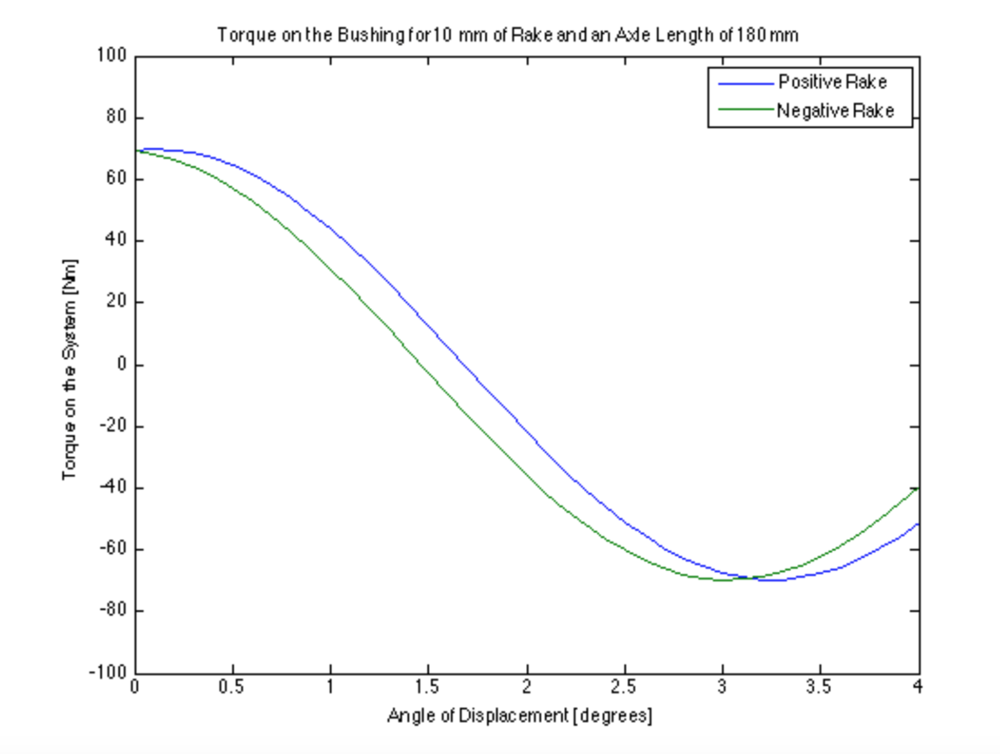
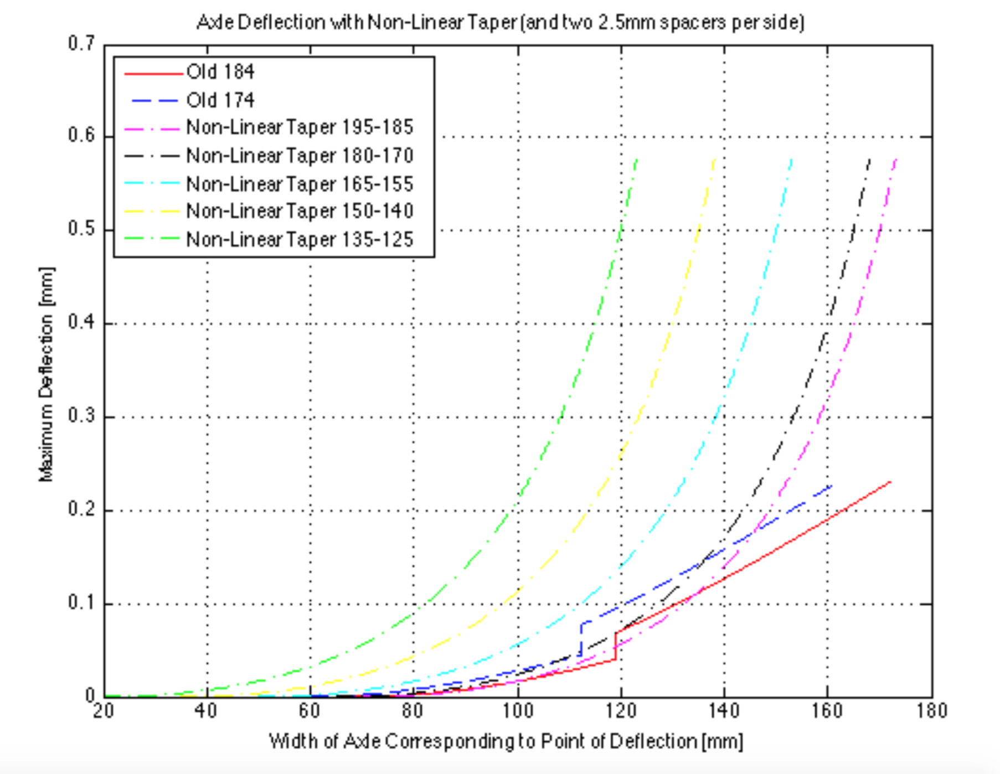

Design and Testing | [Braden Boards](https://www.rojastrucks.com/) | Branson, MO | 6-8/16
--- | --- | --- | ---
* Design and analysis for v2 [30 degree downhill-longboarding truck](https://www.rojastrucks.com/products/rojas-30-deg-plate-kp)
	* Developed matlab scripts to calculate stress and strain profiles
	* Drafted all CAD models based on findings

<table style="width:100%">
  <tr>
    <td>
      
    </td>
    <td>
      
    </td>
  </tr>
  <tr>
    <td>
      
    </td>
    <td>
      
    </td>
  </tr>
</table>

* [Skated downhill semi-professionally](https://vimeo.com/197156490)

* Contact: Jared Braden skate@bradenboards.com (417) 337 - 4506

